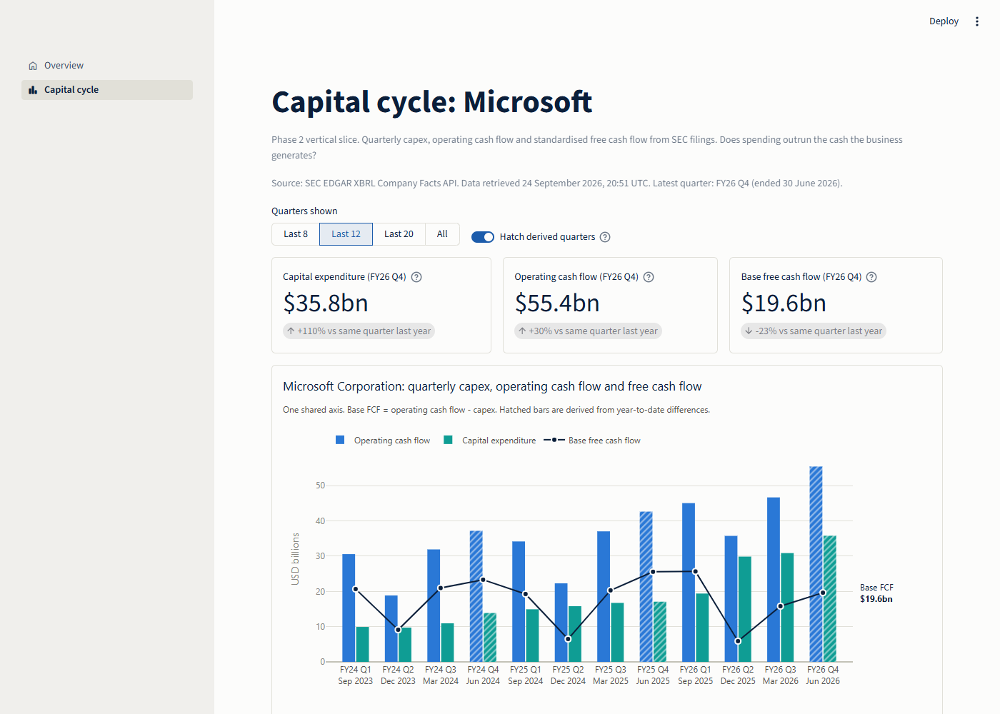

# AI Capital Cycle Monitor: Bubble, Buildout or Both?

A Python and Streamlit research platform testing whether AI-related market expectations are
supported by capital efficiency, free cash flow, adoption and infrastructure economics.

> **Status:** Phase 2 (one-company vertical slice) is complete and awaiting review. Microsoft's
> quarterly revenue, operating cash flow, capex and base free cash flow are built from SEC filings,
> reconciled to the printed statements, and shown on a dashboard page. **There are no findings or
> conclusions yet.** This is educational research, not investment advice.



*Real data: Microsoft, retrieved from the SEC on 24 September 2026. Hatched bars are derived
fourth quarters. Base FCF here excludes finance-lease-funded infrastructure, so it must not be read
as a capital-cycle conclusion on its own (see [`docs/xbrl_mapping_msft.md`](docs/xbrl_mapping_msft.md)).*

## Research question

Are public markets pricing the AI capital cycle faster than cash flows, utilisation and
monetisation can justify, and where is the better risk-adjusted opportunity across US AI leaders,
AI infrastructure providers and European banks?

Hypotheses and definitions are frozen in [`docs/methodology.md`](docs/methodology.md) before any
analysis. Known data risks are tracked in [`docs/limitations.md`](docs/limitations.md).

## Principles

- Every displayed number traces to a source in [`data/source_registry.csv`](data/source_registry.csv)
  or an explicit formula.
- Observed, guided, estimated, derived and scenario-modelled values are never mixed.
- Missing is not zero. There is no mock or synthetic data in outputs.
- Secrets and licensed data never enter Git.

## Setup

Requires [uv](https://docs.astral.sh/uv/) and Python 3.12.

```bash
uv sync                      # create .venv and install locked dependencies
cp .env.example .env         # then edit .env with your own values (never committed)
uv run ruff check .          # lint
uv run pytest -q             # tests
```

`.env` needs an SEC EDGAR User-Agent (a real name and contact email, per the SEC fair-access
policy). The [FRED API key](https://fred.stlouisfed.org/docs/api/api_key.html) is only needed for the
later macro-data phase, so it can stay empty. Put real values only in `.env`, never in
`.env.example`, which is committed.

## Run

```bash
uv run ai-capital-cycle verify-identity MSFT   # check configured identifiers against the SEC
uv run ai-capital-cycle audit-tags MSFT        # which XBRL tags Microsoft uses, by fiscal year
uv run ai-capital-cycle build MSFT             # fetch, assemble and write the dataset
uv run streamlit run app/streamlit_app.py      # start the dashboard
```

Raw SEC responses are stored verbatim and checksummed under `data/raw/sec/` (see
[`data/README.md`](data/README.md)). Nothing under `data/raw`, `interim` or `processed` is
committed. Evidence for the Microsoft build: [`docs/xbrl_mapping_msft.md`](docs/xbrl_mapping_msft.md)
and [`docs/reconciliation_msft.md`](docs/reconciliation_msft.md).

## Repository layout

```text
app/            Streamlit app: streamlit_app.py (st.navigation) and app_pages/
config/         YAML: companies, metric definitions, XBRL tag mappings, events
data/           raw / interim / processed (untracked contents) and source_registry.csv
docs/           methodology, data dictionary, limitations, chart catalogue
references/     Harvard reference list and BibTeX
reports/        figures and the research report
src/ai_capital_cycle_monitor/
  clients/      SEC client and the append-only raw-response store
  pipelines/    XBRL selection, quarter derivation, dataset assembly, build
  analysis/     free cash flow (ratios, relative value and event study to come)
  charts/       Plotly figures and the validated colour theme
  schemas/      Pydantic models
  utils/        paths, settings, fiscal calendar, config and registry loaders
  views/        data preparation for Streamlit pages
  cli.py        ai-capital-cycle command
tests/          pytest suite
```

## Roadmap

| Phase | Scope | Status |
|---|---|---|
| 1 | Foundations: tooling, config, schemas, docs, CI | Done |
| 2 | One-company vertical slice, reconciled to its filing | Done, awaiting review |
| 3 | Hyperscaler panel | Planned |
| 4 | European banks, relative value, reverse DCF | Planned |
| 5 | Compute economics: tokens, GPU prices, neoclouds | Planned |
| 6 | Event study | Planned |
| 7 | Publication: report, references, release | Planned |
